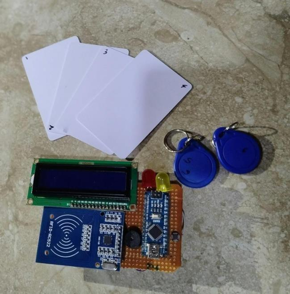
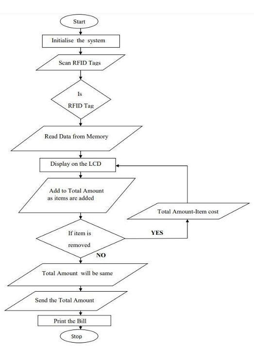
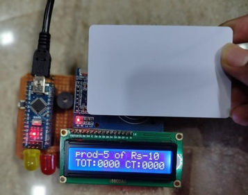
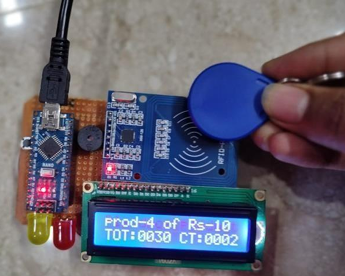

# 🛒 Smart Shopping Cart with Automatic Billing System using Arduino

An IoT-based smart shopping cart that automatically scans products and generates the total bill using RFID technology. This system eliminates long queues at billing counters and enhances the shopping experience by enabling real-time billing directly on the cart.

---

## 📌 Overview

Traditional shopping requires customers to wait in long queues for billing, which wastes time and reduces efficiency. This project introduces an intelligent shopping cart that uses RFID technology to automatically detect products placed inside the cart and calculate the total bill instantly.

Each product is equipped with an RFID tag, and the cart contains an RFID reader connected to an Arduino Nano. When a product is added or removed, the system updates the bill automatically and displays the information on an LCD screen.

This system reduces human effort, saves time, and improves the overall shopping experience.

---

## ✨ Key Features

- Automatic product identification using RFID tags
- Real-time billing displayed on LCD screen
- Ability to add or remove items easily
- Instant price calculation
- Reduced waiting time at checkout counters
- Low-cost and efficient solution
- Easy to implement and expand
- User-friendly interface

---

## 🧰 Hardware Components

| Component | Description |
|----------|-------------|
| Arduino Nano | Main microcontroller |
| EM-18 RFID Reader | Reads RFID tag data |
| RFID Tags | Attached to products |
| 16x2 LCD Display | Displays product details and total price |
| Push Button | Used to remove items |
| Red LED | Indicates product removal |
| Green LED | Indicates product addition |
| Buzzer | Provides scan indication |
| 10K Potentiometer | Adjusts LCD contrast |
| 18650 Li-ion Batteries | Power supply |

---

## 🏗️ System Architecture

The system consists of an RFID reader connected to an Arduino Nano. Each product contains an RFID tag with a unique ID. When the tag is scanned, the Arduino retrieves product information and updates the total bill.

The LCD screen displays:
- Product name
- Product price
- Total amount

LED indicators and buzzer provide feedback during scanning operations.

---

## ⚙️ Working Principle

1. The system starts and displays a welcome message on the LCD.
2. Each product contains an RFID tag with a unique ID.
3. When a product is placed in the cart, the RFID reader scans the tag.
4. The Arduino processes the tag data and retrieves the product price.
5. The LCD displays the product name and updated total price.
6. If the user wants to remove a product, they press the button and scan the tag again.
7. The system subtracts the product price automatically.
8. The final total amount is displayed for payment.

---

## 📊 Advantages

- Eliminates long billing queues
- Saves time for customers
- Reduces manpower requirements
- Provides accurate billing
- Improves shopping efficiency
- Supports digital retail transformation

---

## 💻 Software Requirements

- Arduino IDE
- Required Libraries:
  - SPI
  - MFRC522
  - LiquidCrystal_I2C
  - Wire

Install libraries through Arduino IDE Library Manager.

---

## 🔌 Circuit Connections

### RFID Module to Arduino
| RFID Pin | Arduino Pin |
|---------|------------|
| TX | RX0 |
| VCC | 5V |
| GND | GND |

### LCD to Arduino
| LCD Pin | Arduino Pin |
|--------|-------------|
| RS | D12 |
| EN | D11 |
| D4 | D10 |
| D5 | D9 |
| D6 | D8 |
| D7 | D7 |

### Other Connections
| Component | Arduino Pin |
|----------|------------|
| Green LED | D5 |
| Red LED | D4 |
| Buzzer | D6 |
| Push Button | A4 |

---

## 📸 Project Demonstration

### Hardware Setup

### Components

### Flowchart

### Output Display

---

## 🚀 Future Improvements

- Integration with mobile application
- Online payment gateway support
- Cloud database for product management
- Inventory tracking system
- Advanced RFID reader for multiple tag detection
- Waterproof and metal-resistant RFID tags
- Barcode + RFID hybrid system
- AI-based product recommendations

---

## 📚 Applications

- Supermarkets
- Shopping malls
- Retail stores
- Automated billing systems
- Smart trolley systems
- IoT-based retail solutions

---

## 🧑‍💻 Author

**Kolukula Prasanth**  
Electronics Engineer  
Interested in Robotics, Automation and Embedded Systems

---
## Project Report

📄 [Download Full Report](docs/project_report.pdf)

---
## ⭐ Support

If you found this project useful, consider giving it a star ⭐ on GitHub to support the work.
